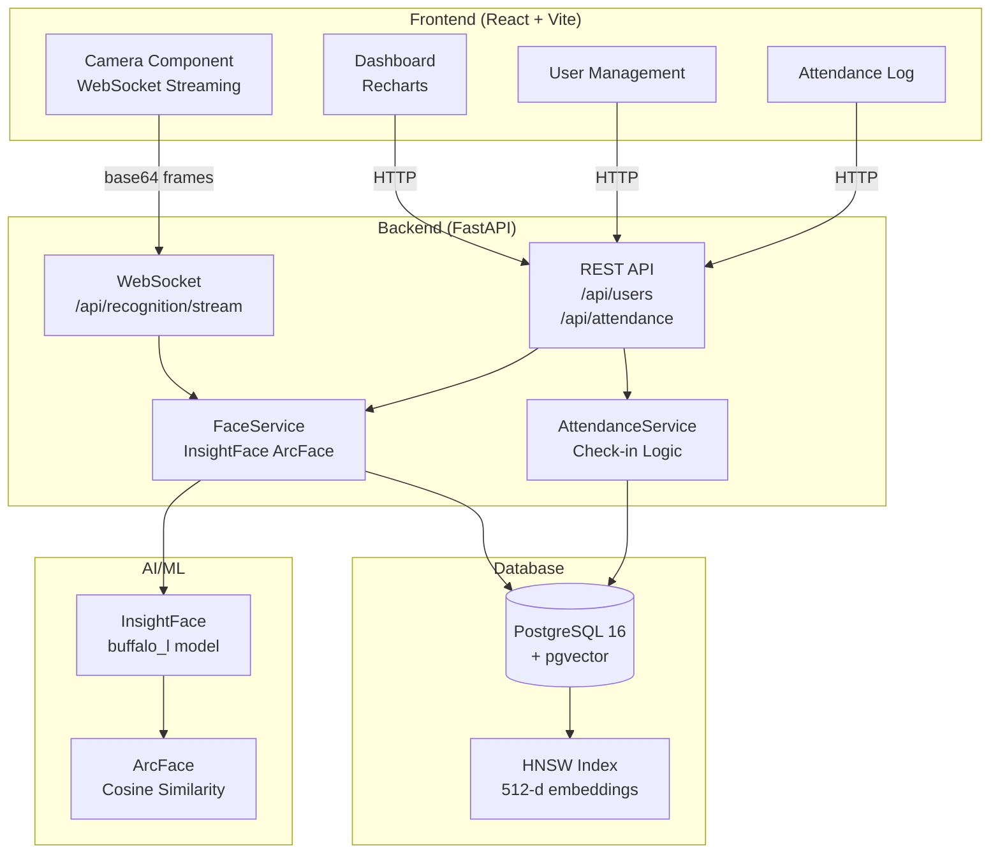

# 👁️ Face Attendance System

<div align="center">

[](https://python.org)
[](https://fastapi.tiangolo.com)
[](https://react.dev)
[](https://docker.com)
[](https://postgresql.org)
[](LICENSE)
[](https://github.com/tangmanh891/face-attendance-system/actions/workflows/ci.yml)

**Hệ thống Điểm danh Tự động sử dụng Nhận diện Khuôn mặt ArcFace**

*Real-time face recognition attendance tracking powered by InsightFace (ArcFace) + pgvector*

[Demo](#screenshots) · [Quick Start](#-quick-start) · [API Docs](#-api-endpoints) · [Roadmap](#-roadmap)

</div>

---

## ✨ Tính năng

- 🎯 **Nhận diện khuôn mặt real-time** – ArcFace (InsightFace buffalo_l) với độ chính xác cao
- 📡 **WebSocket streaming** – Camera stream 10 FPS với bounding box overlay
- 🗄️ **pgvector** – Lưu trữ và tìm kiếm embedding 512 chiều với HNSW index
- ⚡ **Auto check-in** – Tự động ghi nhận khi confidence vượt ngưỡng
- 📊 **Dashboard** – Biểu đồ thống kê weekly/monthly với Recharts
- 👥 **Quản lý nhân viên** – CRUD đầy đủ với ảnh khuôn mặt
- 📋 **Lịch sử điểm danh** – Lọc theo ngày, phòng ban, trạng thái + xuất CSV
- 🔐 **Token bảo vệ demo** – API quản trị và camera stream được bảo vệ bằng admin/camera token
- 🐳 **Docker Compose** – One-command deployment
- 🔄 **GitHub Actions CI/CD** – Lint + Test + Build

---

## 💼 Portfolio Highlights

Dự án này được thiết kế như một full-stack portfolio project có thể đưa vào CV:

- Xây dựng hệ thống điểm danh end-to-end với React, FastAPI, PostgreSQL/pgvector và InsightFace ArcFace.
- Xử lý camera real-time qua WebSocket, nhận diện embedding, cooldown check-in và dashboard thống kê.
- Thiết kế REST API bất đồng bộ cho quản lý nhân viên, lịch sử điểm danh, export CSV và health check.
- Docker hoá toàn bộ stack, có migration Alembic, validation ảnh, token guard và test tự động cho các phần lõi.

Gợi ý bullet CV:

> Built a full-stack face attendance system using React, FastAPI, PostgreSQL/pgvector, and InsightFace ArcFace for real-time employee check-in via WebSocket camera streaming.

---

## 🏗️ Kiến trúc hệ thống



---

## 📁 Cấu trúc dự án

```
face-attendance-system/
├── backend/
│   ├── app/
│   │   ├── main.py              # FastAPI app với CORS, lifespan
│   │   ├── config.py            # Pydantic settings
│   │   ├── database.py          # Async SQLAlchemy + pgvector
│   │   ├── models/              # SQLAlchemy ORM models
│   │   │   ├── user.py          # User (+ Vector(512) embedding)
│   │   │   └── attendance.py    # Attendance (status enum)
│   │   ├── schemas/             # Pydantic request/response schemas
│   │   ├── routers/             # FastAPI routers
│   │   │   ├── users.py         # CRUD nhân viên
│   │   │   ├── attendance.py    # Check-in/out, history, stats
│   │   │   └── recognition.py   # Detect, identify, WebSocket
│   │   ├── services/
│   │   │   ├── face_service.py  # InsightFace ArcFace core
│   │   │   └── attendance_service.py
│   │   └── utils/
│   │       └── image_utils.py   # Base64, resize, save
│   ├── alembic/                 # Database migrations
│   ├── tests/                   # pytest tests
│   ├── requirements.txt
│   └── Dockerfile
├── frontend/
│   ├── src/
│   │   ├── components/
│   │   │   ├── Camera.jsx       # WebSocket + canvas overlay
│   │   │   ├── Dashboard.jsx    # Stats + charts
│   │   │   ├── UserManagement.jsx
│   │   │   └── AttendanceLog.jsx
│   │   ├── services/api.js      # Axios API client
│   │   ├── App.jsx              # Router + Layout
│   │   └── main.jsx
│   ├── package.json
│   └── Dockerfile
├── docker-compose.yml
├── .github/workflows/ci.yml
└── .env.example
```

---

## 🚀 Quick Start

### Prerequisites

- Docker & Docker Compose v2
- (Optional) Python 3.11, Node.js 20 cho development

### 1. Clone & cấu hình

```bash
git clone https://github.com/tangmanh891/face-attendance-system.git
cd face-attendance-system

# Tạo file .env từ example
cp .env.example .env
# Chỉnh sửa .env với mật khẩu thực của bạn
```

### 2. Chạy với Docker Compose (One command!)

```bash
docker compose up -d
```

Mở trình duyệt:
- 🌐 **Frontend**: http://localhost:3000
- 📚 **API Docs**: http://localhost:8000/docs
- 🗄️ **Database**: localhost:5432

### 3. Chạy migrations

```bash
docker compose exec backend alembic upgrade head
```

### 4. Đăng nhập demo trên frontend

Mặc định Docker Compose dùng token demo:

```text
dev-admin-token
```

Nhập token này ở ô **Admin token** trong sidebar để dùng các chức năng quản trị và camera stream. Khi dùng ngoài demo, hãy đổi `ADMIN_API_KEY` và `CAMERA_STREAM_TOKEN` trong `.env`.

---

## 💻 Development Setup

### Backend

```bash
cd backend

# Tạo virtual environment
python -m venv .venv
source .venv/bin/activate  # Linux/Mac
# .venv\Scripts\activate    # Windows

# Cài đặt dependencies
pip install -r requirements.txt

# Chạy database (PostgreSQL + pgvector)
docker compose up db -d

# Chạy migrations
alembic upgrade head

# Khởi động backend
uvicorn app.main:app --reload --port 8000
```

### Frontend

```bash
cd frontend
npm install
npm run dev
# Mở http://localhost:5173
```

---

## 📡 API Endpoints

Các endpoint quản trị yêu cầu một trong hai header:

```http
Authorization: Bearer <ADMIN_API_KEY>
X-Admin-Token: <ADMIN_API_KEY>
```

WebSocket camera dùng query token:

```text
ws://localhost:8000/api/recognition/stream?token=<CAMERA_STREAM_TOKEN>
```

### Users `/api/users`

> Yêu cầu admin token.

| Method | Endpoint | Mô tả |
|--------|----------|-------|
| POST | `/register` | Đăng ký nhân viên + ảnh khuôn mặt |
| GET | `/` | Danh sách nhân viên (phân trang, tìm kiếm) |
| GET | `/{id}` | Thông tin nhân viên |
| PUT | `/{id}` | Cập nhật thông tin |
| DELETE | `/{id}` | Xoá nhân viên (soft delete) |
| PUT | `/{id}/face` | Cập nhật ảnh khuôn mặt |

### Attendance `/api/attendance`

| Method | Endpoint | Mô tả |
|--------|----------|-------|
| POST | `/check-in` | Check-in bằng nhận diện khuôn mặt |
| POST | `/check-out` | Check-out bằng ảnh; check-out thủ công bằng `user_id` cần admin token |
| GET | `/today` | Điểm danh hôm nay |
| GET | `/history` | Lịch sử (lọc theo ngày, phòng ban, trạng thái) – cần admin token |
| GET | `/stats` | Thống kê tổng quan |
| GET | `/export` | Xuất CSV – cần admin token |

### Recognition `/api/recognition`

| Method | Endpoint | Mô tả |
|--------|----------|-------|
| POST | `/detect` | Phát hiện khuôn mặt trong ảnh |
| POST | `/identify` | Nhận diện khuôn mặt |
| WS | `/stream` | WebSocket real-time stream |

#### WebSocket Message Format

**Client → Server:**
```json
{ "type": "frame", "image": "data:image/jpeg;base64,..." }
```

**Server → Client:**
```json
{
  "type": "result",
  "faces": [
    {
      "bbox": [x1, y1, x2, y2],
      "name": "Nguyễn Văn A",
      "employee_id": "NV001",
      "confidence": 0.87,
      "checked_in": true
    }
  ],
  "fps": 9.8,
  "face_count": 1
}
```

---

## 🖼️ Screenshots

> *Screenshots sẽ được thêm sau khi deploy*

| Dashboard | Camera Điểm danh |
|-----------|-----------------|
|  |  |

---

## ⚙️ Cấu hình

Xem [`.env.example`](.env.example) để biết tất cả biến môi trường:

| Biến | Mặc định | Mô tả |
|------|---------|-------|
| `DATABASE_URL` | `postgresql+asyncpg://...` | Connection string PostgreSQL |
| `INSIGHTFACE_MODEL` | `buffalo_l` | Model InsightFace |
| `FACE_RECOGNITION_THRESHOLD` | `0.4` | Ngưỡng cosine similarity |
| `WORK_START_TIME` | `08:00` | Giờ bắt đầu làm việc |
| `WORK_END_TIME` | `17:00` | Giờ kết thúc làm việc |
| `LATE_THRESHOLD_MINUTES` | `15` | Số phút cho phép đi trễ |
| `CHECKIN_COOLDOWN_MINUTES` | `5` | Cooldown giữa 2 lần check-in |
| `TIMEZONE` | `Asia/Ho_Chi_Minh` | Timezone nghiệp vụ điểm danh |
| `ADMIN_API_KEY` | `dev-admin-token` | Token bảo vệ API quản trị |
| `CAMERA_STREAM_TOKEN` | `dev-admin-token` | Token bảo vệ WebSocket camera |

---

## 🧪 Testing

```bash
# Backend tests
cd backend
pytest tests/ -v

# Frontend tests
cd frontend
npm test
```

---

## 🗺️ Roadmap

- [ ] 🔐 Xác thực admin với JWT
- [ ] 📱 Progressive Web App (PWA)
- [ ] 📧 Email thông báo điểm danh
- [ ] 🌐 Multi-language support (i18n)
- [ ] 📊 Export báo cáo PDF
- [ ] 🤖 Chống giả mạo (liveness detection)
- [ ] ☁️ Cloud deployment (AWS/GCP/Azure)
- [ ] 📱 Mobile app (React Native)

---

## 🤝 Contributing

1. Fork repository
2. Tạo branch: `git checkout -b feature/ten-tinh-nang`
3. Commit: `git commit -m 'feat: thêm tính năng X'`
4. Push: `git push origin feature/ten-tinh-nang`
5. Mở Pull Request

---

## 📄 License

[MIT](LICENSE) © 2024 Face Attendance System

---

<div align="center">
Made with ❤️ using FastAPI + React + InsightFace
</div>
